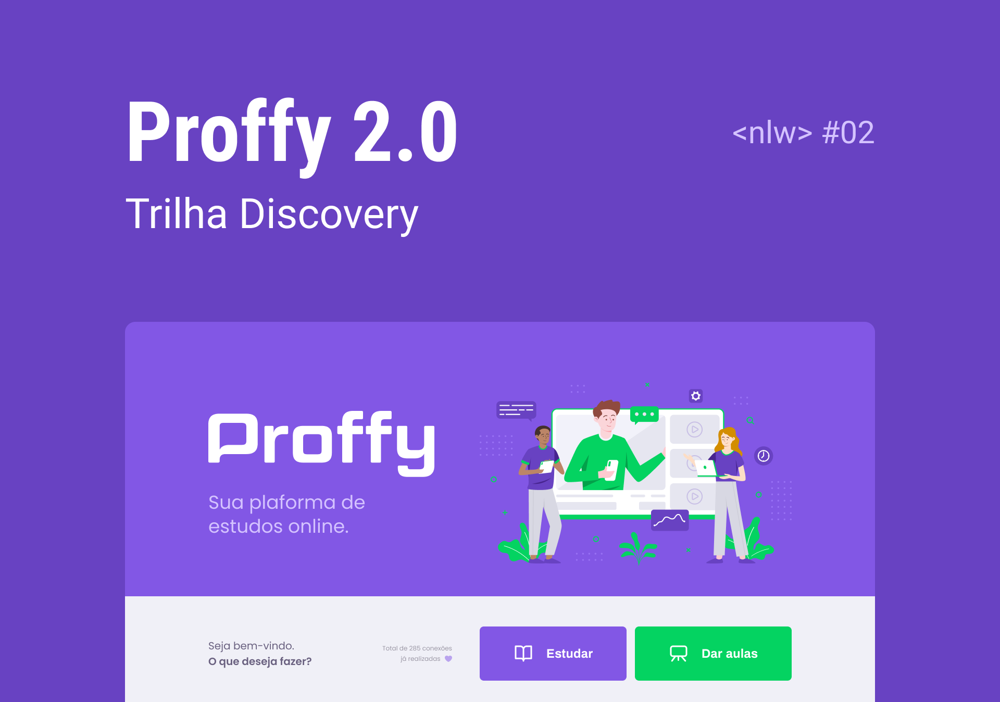
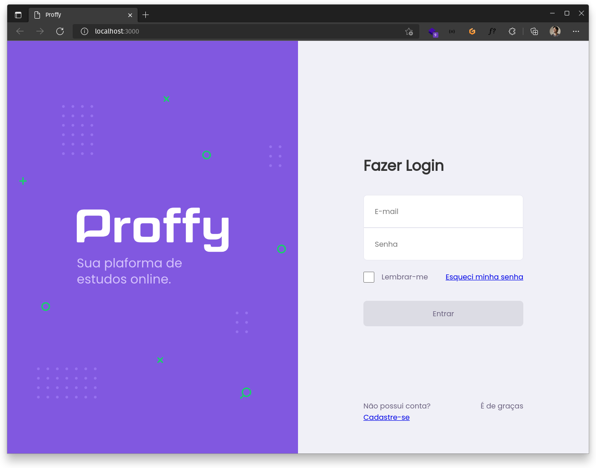
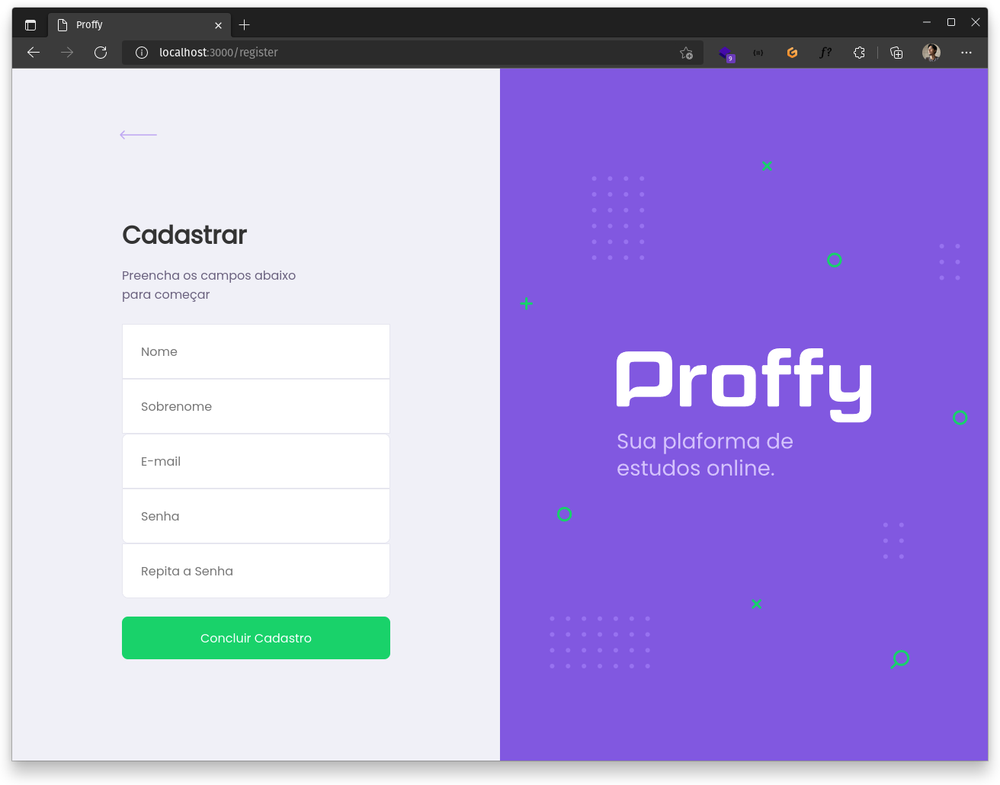
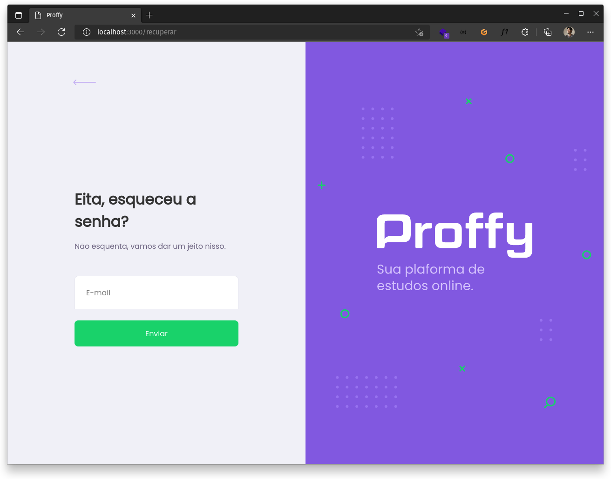
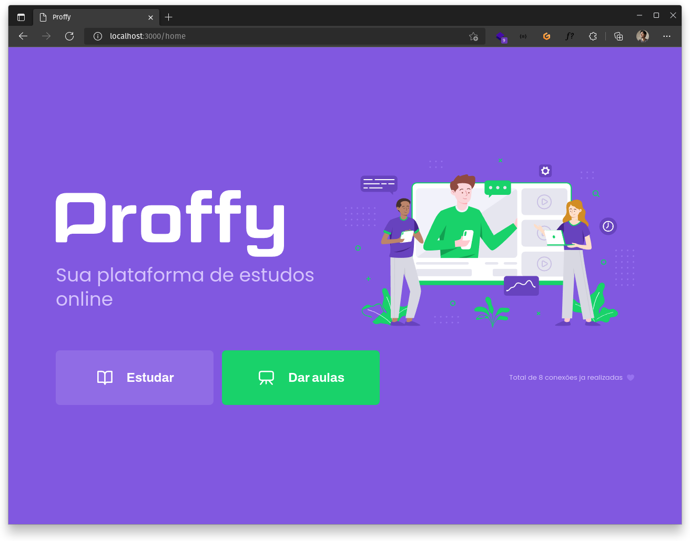
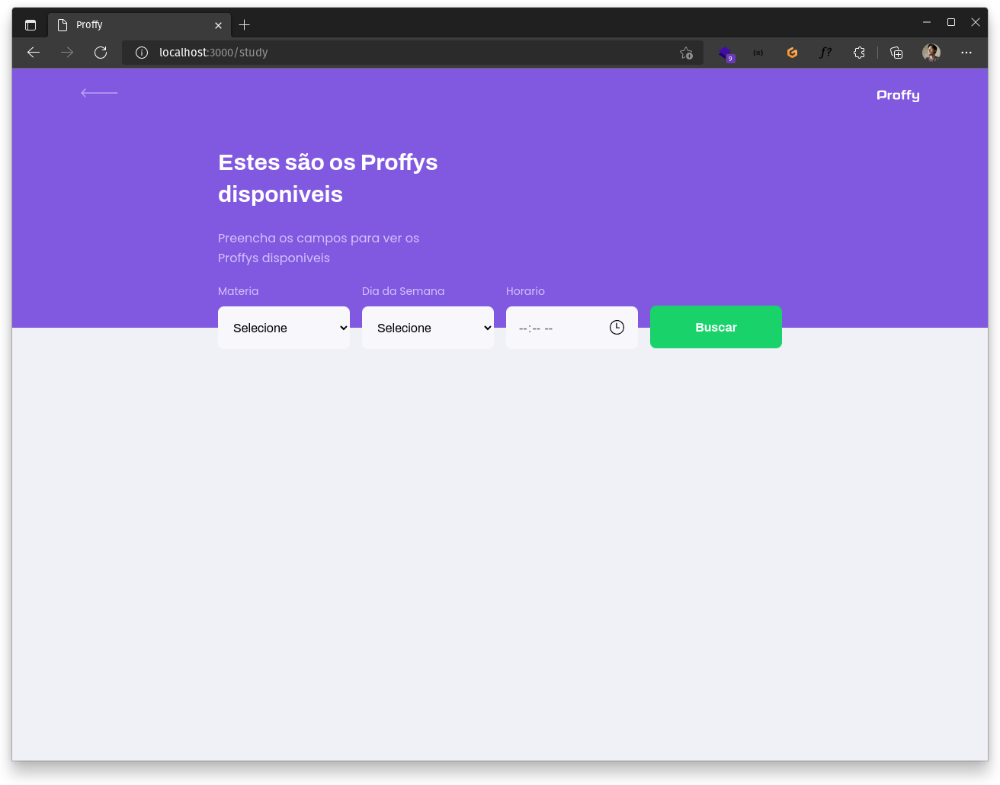
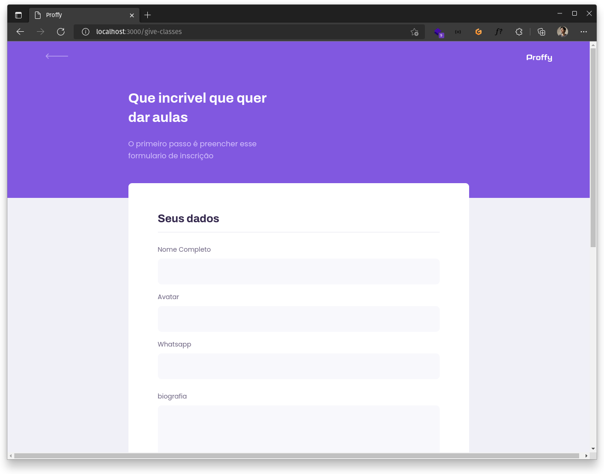

<p align="center">
  
</p>

<p align="center">
   
</p>

<br>

## 🧪 Tecnologias

Esse projeto foi desenvolvido com as seguintes tecnologias:

- [React](https://reactjs.org)
- [Firebase](https://firebase.google.com/)
- [TypeScript](https://www.typescriptlang.org/)


## 🚀 Como executar

Clone o projeto e acesse a pasta do mesmo.

```bash
$ git clone https://github.com/MatheusFontenele/proffy
$ cd proffy-web
```

Para iniciá-lo, siga os passos abaixo:
```bash
# Instalar as dependências
$ yarn

# Iniciar o projeto
$ yarn start
```
O app estará disponível no seu browser pelo endereço http://localhost:3000.

Lembrando que será necessário criar uma conta no [Firebase](https://firebase.google.com/) um projeto para disponibilizar um Realtime Database e as chaves de acesso.

## 💻 Projeto

Proffy é uma plataforma de estudos online, onde professores se disponiblizam informando valores e horarios disponiveis, e os alunos entram em contato com os mesmos. 

Este é um projeto desenvolvido durante a **[Next Level Week Together](https://nextlevelweek.com/)**, apresentada dos dias 20 a 27 de Junho de 2021.

## 🔖 Layout

### Login page
<p align="center">
  
</p>

### Login register page
<p align="center">
  
</p>

### Recover password
<p align="center">
  
</p>

### Home page
<p align="center">
  
</p>

### Teacher page
<p align="center">
  
</p>

### Register teacher page
<p align="center">
  
</p>


Você pode visualizar o layout do projeto através do link abaixo:

- [Layout Web](https://www.figma.com/file/8d8BPhz2jwyFIfFvcVtiJe/Proffy-Web-2.0?node-id=2%3A7) 

Lembrando que você precisa ter uma conta no [Figma](http://figma.com/).

## 📝 License

Esse projeto está sob a licença MIT. Veja o arquivo [LICENSE](LICENSE.md) para mais detalhes.

---

Feito com 💜 by Matheus 👋🏻
